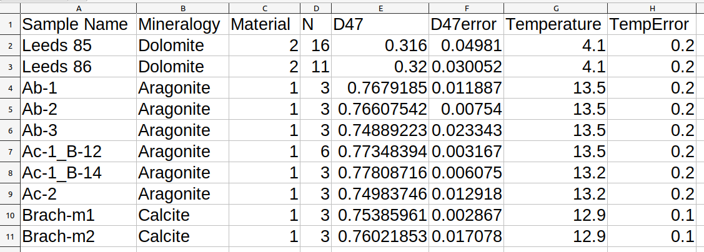
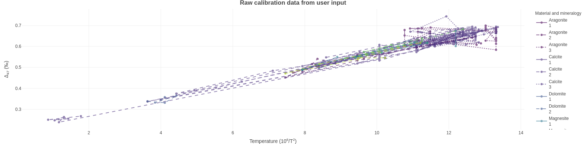
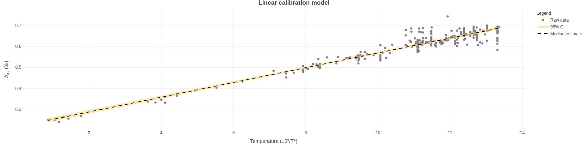

# BayClump

Welcome to the main repository to the [BayClump Shiny Dashboard](https://bayclump.tripatilab.epss.ucla.edu/).

## Publication Information  

C. Román-Palacios, H. M. Carroll, A. J. Arnold, R. J. Flores, Q. Guan, S. Petersen, K. A. McKinnon, and A. Tripati. **BayClump: Bayesian Calibration Models of the ‘Clumped Isotopes’ Paleothermometer**. Under review in *Geochemistry, Geophysics, Geosystems*. [Preprint](https://www.essoar.org/doi/10.1002/essoar.10507995.2).  

## Contact Information

**Developers**

Hannah M. Carroll [hcarroll@epss.ucla.edu](mailto:hcarroll@epss.ucla.edu)  
Cristian Román-Palacios [cromanpa@g.ucla.edu](mailto:cromanpa@arizona.edu)  

**Senior author**

Aradhna Tripati [atripati@g.ucla.edu](mailto:atripati@g.ucla.edu)  

**GitHub repo**

<https://github.com/Tripati-Lab/BayClump>

**Bug reports and issues**

<https://github.com/Tripati-Lab/BayClump/issues>

## BayClump Basics

BayClump version 0.9 was developed in R version 4.1.0 and RStudio version 1.4.1106. This app accompanies Román-Palacios et al. (xxxx): BayClump: Bayesian Calibration and Temperature Reconstructions for Clumped Isotope Thermometry  

BayClump is separated into calibration and reconstruction workflows. Any calibration models selected on the Calibrations tab are automatically made available for use in the Reconstructions tab. At this time, only $Δ_{47}$-based calibrations and reconstructions are supported.

### Default calibration data

Two calibration datasets are included in BayClump by default. Model 1 is based on the reprocessed datasets of [Petersen et al. (2019)](http://dx.doi.org/10.1029/2018GC008127). Model 2 is based on the reprocessed and original datasets of [Anderson et al. (2021)](https://doi.org/10.1029/2020GL092069). The datasets from Petersen et al. (2019) have been reprojected into the I-CDES reference frame after [Bernasconi et al. (2021)](https://doi.org/10.1029/2020GC009588) at a growth temperature of 90°C, so as to be compatible with the datasets of Anderson et al. (2021). Throughout, we refer to this as $I-CDES_{90}$.

The default calibration datasets may be used individually or in combination to create calibration models, and may also be combined with the user's own calibration data in the I-CDES 90 reference frame. The user may also choose to work exclusively with their own calibration data in $I-CDES_{90}$ or another reference frame if desired. At this time, BayClump does not provide the option to reproject the default calibration datasets into a different reference frame.

### Uploading calibration data

BayClump provides a template for users to upload calibration data. It can be downloaded from the Calibrations tab. Sample data are shown in the first ten rows of the template and should be overwritten. **The template must be left in .csv format, although the user is free to change the name of the spreadsheet as needed. Do not change column headings or orders.** Do not enter extra columns - these will not be used by the app and may create problems.  

**Sample Name:** This should be a unique identifier for each sample. Combinations of letters, numbers, spaces, and special characters may be used. It is best to avoid number signs (`#`) as this may cause the code behind BayClump to malfunction.  

**Mineralogy:** This should be the full, capitalized name, i.e., Aragonite, Calcite, Dolomite, Mixed, Unknown, etc.  

**Material:** This must be entered as a number, where 1 = Natural, 2 = Synthetic, and 3 = Biogenic. Additional numbers may be used as necessary. All preloaded data in the app follow this convention.  

**N:** The number of replicates measured to produce the final value. This must be numeric - no letters or special characters are accepted.  

**D47:** The final $Δ_{47}$ value of the sample after completing all appropriate quality assurance steps. This must be numeric - no letters or special characters except for periods and minus signs are accepted. Provide as many decimal places as possible to improve calculations.  

**D47error:** The absolute error around $Δ_{47}$ after completing all appropriate quality assurance steps. This should be the combined measurement and correction error. This must be numeric - no letters or special characters except for periods are accepted. Provide as many decimal places as possible to improve calculations.  

**Temperature:** Growth temperature in $10^6/T^2$, where temperature, T, is in Kelvin. This must be numeric - no letters or special characters except for periods and minus signs are accepted.  

**TempError:** Absolute error of the growth temperature in $10^6/T^2$, where temperature, T, is in Kelvin. This must be numeric - no letters or special characters except for periods are accepted.

**Note: You must provide EITHER the number of replicates OR $Δ_{47}$ error. Providing both will not cause problems. If N is provided instead of error, the error will be calculated by the app.**

### Selecting calibration options

#### Scale data  

If calibration data values are produced from a very wide range of growth temperatures, it may be necessary to scale your data prior to analyses. Select this checkbox to automatically scale your data. We call the generic function 'scale' included in base R. Data are scaled by dividing the raw values by their root mean square.

  

## Calibration Model Setup and Selection

BayClump offers five calibration model options. Bootstrapping is used to produce robust estimates of regression coefficients. The user is able to select 50, 100, 500, or 1,000 bootstrap replicates. We recommend that the number of bootstrap replicates chosen be at least 10 times the number of unique samples, with a minimum of 50 and a maximum of 1,000 offered. For example, if you have ten unique samples you wish to use in calibration models, you should choose at least 100 bootstrap replicates (10 x 10). If you have 3 or fewer samples, do not exceed 50 bootstrap replicates.  

**Warning: Selecting all available calibration models and a large number of bootstraps will require significant processing time. This may exceed 30-40 minutes if server traffic is heavy. The app may appear to hang while calculations are being performed, but should complete normally.**  

**Important: Calibration data should be entered into the template in $10^6/T^2$ format, where temperature, T, is in Kelvin.**

### Calibration model descriptions  

**Note: The descriptions provided below are taken from the publication this app accompanies.** For additional information, please see Román-Palacios et al. (xxxx).  

### Simple linear model  

This regression model is the simplest model used in this study. The simple linear regression does not explicitly account for measurement error in $10^6/T^2$ or $Δ_{47}$. Therefore, this model assumes that measurements in both $10^6/T^2$ or $Δ_{47}$ are not imperfect. We fit the simple linear regression model using the lm function in the stats R package under default parameters. Note that the approach implemented in the lm function in R is based on least squares. Under least squares, the resulting regression model is selected as the line that minimizes the sum of squared error (*i.e.*, sum over the squared differences between the points and the line) in the relationship between $10^6/T^2$ or $Δ_{47}$.  

### Inverse weighted linear model  

Simple linear regression fit under least squares, with observations being weighted based on the inverse of their squared uncertainty in the measured $Δ_{47}$. Note that, although this approach indirectly accounts for uncertainty in $Δ_{47}$, weighted models analyzed in this study do not explicitly account for measurement error in $10^6/T^2$. The weighted simple linear regression was fit using the lm function in the stats R package. The weights argument was set to the $1/(standard error)^2$ of each observation. Therefore, observations with higher uncertainty (standard error) had less importance at estimating the error of alternative proposed lines during the least square optimization of the model.   

### Deming regression  

The Deming model also fits under least squares, and the optimization steps while fitting the straight line follow the algorithm of Deming (1943). This model explicitly accounts for measurement error in both $Δ_{47}$ and $10^6/T^2$. Under the Deming regression, the ratio of the weights (related to their uncertainty) in $Δ_{47}$ and $10^6/T^2$ is constant over all data points (Martin 2000). To fit this model, we specified observations in $Δ_{47}$ and $10^6/T^2$, along with the corresponding standard error in each observation. Note that although the Deming model also fits under least squares (see models 1 and 2), the optimization steps while fitting the straight line follows the algorithm presented in Deming (1943).  

### York regression  

The York model is closely related to the Deming regression model. However, under the York model, the ratio of the weights (related to their uncertainty) in $Δ_{47}$ and $10^6/T^2$ varies over data points (Martin 2000). Therefore, the York model is slightly more complex than the Deming regression model. We specified observations in $Δ_{47}$ and $10^6/T^2$, along with the corresponding standard error in each observation, when fitting this regression model.  

### Bayesian simple linear model  

This model is the simplest Bayesian model currently implemented in the app. This Bayesian model is equivalent to the simple linear regression model (Model 1). However, instead of parameter estimates based on least squares, optimization of regression parameters is conducted under a Bayesian framework.  

### Bayesian linear regression model with error in variables  

This model explicitly accounts for measurement error in both $10^6/T^2$ and $Δ_{47}$ during parameter estimation. The Bayesian linear model with error in variables is close to the classical calibration model used in the field, a York model.  

### Bayesian linear mixed model  

In some situations, it is desirable to account for potential differences in the relationship between $Δ_{47}$ and $10^6/T^2$ between a factor (*e.g.* material, species). Under the Bayesian linear mixed model, parameter estimates are performed in accordance with a specific factor. Therefore, this model could be used to examine for potential differences in slope/intercept for a particular grouping variable of interest. We also note that parameter estimates under the Bayesian linear mixed model account for error in both $Δ_{47}$ and $10^6/T^2$2.  

  

## The Calibration Plots Tab

All plots are created in plotly version 4.9.3 (Sievert 2020). They are fully interactive and downloadable. Plots download at web viewing resolution (72 dpi), 1244x400 pixels, and in .png format by default, but may be scaled and resized in external software if desired.  

  

The Calibration Plots tab will display raw calibration data based on user input. The default display is of calibration data for Model 1. It will automatically update to reflect the choice of calibration data made on the Calibrations tab.  

Once calibration model runs are complete, the Calibration Plots tab will update to show plots of raw data on the $10^6/T^2$ temperature scale, with overlaid 95% confidence intervals (credible intervals in the case of the Bayesian model), and a median line.  

  

  

  

## The Reconstructions Tab

### Uploading reconstruction data

BayClump provides a template for users to upload reconstruction data. It can be downloaded from the Reconstructions tab. Sample data are shown in the first ten rows of the template and should be overwritten. The template must be left in .csv format, although the user is free to change the name of the spreadsheet as needed. **Do not change column headings or orders. Do not enter extra columns - these will not be used by the app and may create problems.**  

### Reconstruction options  

Models selected in the Calibrations tab are automatically transferred to the Reconstructions Tab. You are asked to confirm that your calibration and reconstruction data are in the same reference frame before the reconstructions will be performed.  

#### Bayesian versus non-Bayesian predictions  

##### Bayesian predictions  

Temperature predictions for specific $Δ_{47}$ values are performed within a Bayesian framework. These predictions simultaneously propagate error in the target $Δ_{47}$ and regression parameters and target $Δ_{47}$. Simulations suggest that these regression models recover true temperature in more scenarios than most non-Bayesian predictions. Bayesian predictions are only implemented for Bayesian regression models. Selection of this option will not affect reconstructions produced by the non-Bayesian models.  

##### Non-Bayesian predictions  

Temperature predictions are explicitly based on parameter estimates for Bayesian and non-Bayesian models. Parameter estimate and uncertainties follow the median and 95% CI across a certain number of replicates. Therefore, non-Bayesian predictions do not simultaneously propagate uncertainties in parameter estimates and target $Δ_{47}$. Instead, uncertainty propagation is a two step process in non-Bayesian predictions. We present two types of non-Bayesian predictions. First, non-Bayesian predictions could simply ignore parameter error and account for uncertainty in target $Δ_{47}$ (the most common practice in the field). Second, non-Bayesian predictions could account for both sources of error (parameter and $Δ_{47}$ error). Results in the app are shown for both approaches.  

### Reconstruction output  
By default, up to six rows of data for each reconstruction model are displayed in the output. This may be copied and pasted directly into external software if desired. The download button will provide a multi-tabbed spreadsheet in .xlsx format containing the full output from all selected models.  
