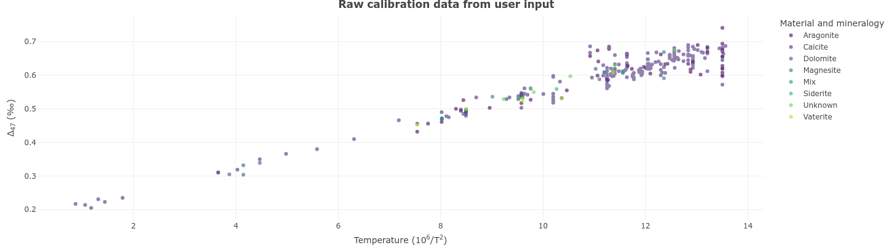
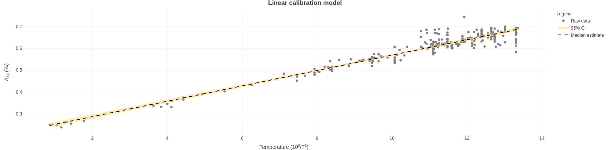

# The Calibration Plots Tab

All plots are created in `plotly` version 4.9.3 (Sievert 2020). They are fully interactive and downloadable. Plots download at web viewing resolution (`72` dpi), `1244x400` pixels, and in `.png` format by default, but may be scaled and resized in external software if desired.  

  

The Calibration Plots tab will display raw calibration data based on user input. The default display is of calibration data for `Model 1`. It will automatically update to reflect the choice of calibration data made on the Calibrations tab.  

Once calibration model runs are complete, the Calibration Plots tab will update to show plots of raw data on the $10^6/T^2$ temperature scale, with overlaid 95% confidence intervals (credible intervals in the case of the Bayesian model), and a median line.  

  

  

  

