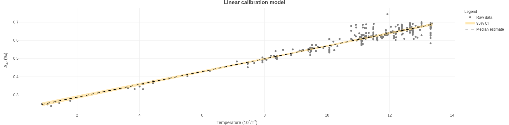

## Publication Information  

C. Román-Palacios, H. M. Carroll, A. J. Arnold, R. J. Flores, Q. Guan, S. Petersen, K. A. McKinnon, and A. Tripati. `BayClump`: Bayesian Calibration Models of the ‘Clumped Isotopes’ Paleothermometer. Under review in *Geochemistry, Geophysics, Geosystems*. [Link](https://www.essoar.org/doi/abs/10.1002/essoar.10507995.2).

  

## Contact Information

**Developers**

Hannah M. Carroll [hcarroll@epss.ucla.edu](mailto:hcarroll@epss.ucla.edu)  
Cristian Román-Palacios [cromanpa@g.ucla.edu](mailto:cromanpa94@arizona.edu)  

**Senior author**

Aradhna Tripati [atripati@g.ucla.edu](mailto:atripati@g.ucla.edu)  

**GitHub repo**

<https://github.com/Tripati-Lab/BayClump>

**Bug reports and issues**

<https://github.com/Tripati-Lab/BayClump/issues>

## News and Updates

*September 26th, 2022* -- *`BayClump` v 1.0.0*  

`BayClump` now runs on `stan`!

We have fully migrated `BayClump's` Bayes engine from JAGS 4.3.0 to `stan` 2.30.0 (<https://mc-stan.org/>) via the `rstan` package (<http://mc-stan.org/rstan/>). This change speeds up calculations and improves overall performance.  

### Updates to the user interface 

Changes to the Calibration tab:  
- You can now select the number of Bayesian iterations to keep rather than setting a total number of Bayesian iteration to run (default is 3,000)  
- You can now elect to use Informative, Weakly Informative, or Uninformative priors for fitting Bayesian models  
- Model selection for Bayesian models now uses log likelihoods from `loo` 2.5.1 (<https://mc-stan.org/loo/>)  

Changes to the Reconstruction tab:  
- Removed option for the Classic Calibration Approach  
- Added an option for model inversion to follow the inverse prediction interval (IPI) approach of [McClelland et al. (2021)](https://doi.org/10.1029/2021GL092773)  

*March 28th, 2022* -- *`BayClump` v 0.9.1*  

We have a News and Updates section now! Stay tuned for info on what's new with `BayClump`.  

### Updates to functions  

The BayClump team is grateful to Ilja Kocken, author of the `clumpedr` package, for alerting us to a problem with the way `clumpedr's` `revcal` function propagates uncertainties and deals with covariance between slope and intercept. You can see the issue on `BayClump`'s GitHub repo here: [Issue #7](https://github.com/Tripati-Lab/BayClump/issues/7) and the subsequent update to `clumpedr` here on [Ilja's GitHub repo](https://github.com/isoverse/clumpedr/commit/31a60b10f3d36b395722a1a4ee11884a34480ae9).  

The latest version of `BayClump` propagates uncertainties using two alternative approaches that are outlined in detail in our [paper](https://www.essoar.org/doi/abs/10.1002/essoar.10507995.2). In general, the inversion process for estimating $T_{(^\circ C)}$ follows the following structure:

$$
T_{(^\circ C)}= \sqrt{\frac{\beta * 10^6}{\Delta_{47} - \alpha}} - 273.15
$$

Temperature error is propagated in a Bayesian framework based on parameter uncertainty and uncertainty in the analyzed $\Delta_{47}$. For non-Bayesian models, uncertainty is calculated as the difference between the point estimates of $T_{(^\circ C)}$ for $\Delta_{47}$ and $\Delta_{47} + SE(\Delta_{47})$.

### Updates to the user interface  

Lots has changed with this update!  

Additions to the Calibration tab include:  
- A slider that allows users to select the temperature range for estimation of confidence intervals  
- The option to change the number of iterations to use for Bayesian models (default is 20,000)  
- The option to change the number of observations per bootstrap sample (default scales to the calibration data selected)  
- The option to multicore Deming regressions to improve computing time  
- A menu to select either informative or diffuse priors for Bayesian models  
- Additional download buttons for raw Bayesian outputs, posteriors, and priors  
- More detailed progress bar messages  

Additions to the Reconstruction tab include:  
- Additional download buttons for priors and posteriors for Bayesian prediction models  

## `BayClump` Basics

`BayClump` version 0.9.2 was developed in `R` version 4.1.2 and `RStudio` version 1.4.1106. It has been tested up to `R` 4.2.1 and `RStudio` 2022.02.3+492. This app accompanies Román-Palacios et al. *under revision*: `BayClump`: Bayesian Calibration and Temperature Reconstructions for Clumped Isotope Thermometry. [Link](https://www.essoar.org/doi/abs/10.1002/essoar.10507995.2).

`BayClump` is separated into calibration and reconstruction workflows. Any calibration models selected on the Calibrations tab are automatically made available for use in the Reconstructions tab. At this time, only $Δ_{47}$-based calibrations and reconstructions are supported.

### Default calibration data

Two calibration datasets are included in `BayClump` by default. Model 1 is based on the reprocessed datasets of [Petersen et al. (2019)](http://dx.doi.org/10.1029/2018GC008127). Model 2 is based on the reprocessed and original datasets of [Anderson et al. (2021)](https://doi.org/10.1029/2020GL092069). The datasets from Petersen et al. (2019) have been reprojected into the I-CDES reference frame after [Bernasconi et al. (2021)](https://doi.org/10.1029/2020GC009588) at a growth temperature of 90°C, so as to be compatible with the datasets of Anderson et al. (2021). Throughout, we refer to this as $I-CDES_{90}$.

The default calibration datasets may be used individually or in combination to create calibration models, and may also be combined with the user's own calibration data in the I-CDES 90 reference frame. The user may also choose to work exclusively with their own calibration data in $I-CDES_{90}$ or another reference frame if desired. At this time, `BayClump` does not provide the option to reproject the default calibration datasets into a different reference frame.

### Uploading calibration data

`BayClump` provides a template for users to upload calibration data. It can be downloaded from the `Calibrations` tab. Sample data are shown in the first ten rows of the template and should be overwritten. A few important notes on the structure of your calibration dataset:

- The template must be left in `.csv` format, although the user is free to change the name of the spreadsheet as needed. Do not change column headings or orders.
- Do not enter extra columns - these will not be used by the app and may create problems.  
- Please make sure that uncertainties are all ` > 0`. The app will not run otherwise and will print a message to the console.
- The dataset MUST present sample-level observations. Rows are not expected to reflect replicates per sample.
- If a sample was analyzed under a single replicate, please assign the instrument's uncertainty as the error.

Below, we provide a brief description of the columns that are required in the calibration dataset.

- **Sample Name:** This should be a unique identifier for each sample. Combinations of letters, numbers, spaces, and special characters may be used. It is best to avoid number signs (`#`) as this may cause the code behind `BayClump` to malfunction.  

- **Mineralogy:** This should be the full, capitalized name, i.e., Aragonite, Calcite, Dolomite, Mixed, Unknown, etc.  

- **Material:** This must be entered as a number. If you are using any of the preloaded calibration sets, be sure to follow the convention 1 = Natural, 2 = Synthetic, and 3 = Biogenic to match those datasets. Additional numbers may be used as necessary. If you are using strictly your own calibration data, you can select your own convention. We only ask that the sequence of materials that you select must start at 1 and that you should not skip numbers (e.g. Incorrect: `1` = Natural, `3` = Synthetic).    

- **N:** The number of replicates measured to produce the final value. This must be numeric - no letters or special characters are accepted.  

- **D47:** The final $Δ_{47}$ value of the sample after completing all appropriate quality assurance steps. This must be numeric - no letters or special characters except for periods and minus signs are accepted. Provide as many decimal places as possible to improve calculations.  

- **D47error:** The standard error around $Δ_{47}$ after completing all appropriate quality assurance steps. This should be the combined measurement and correction error. This must be numeric - no letters or special characters except for periods are accepted. Provide as many decimal places as possible to improve calculations. **Please make sure that this column has no negative numbers**.

- **Temperature:** Growth temperature in $10^6/T^2$, where temperature, T, is in Kelvin. This must be numeric - no letters or special characters except for periods and minus signs are accepted.  

- **TempError:** Absolute error of the growth temperature in $10^6/T^2$, where temperature, T, is in Kelvin. This must be numeric - no letters or special characters except for periods are accepted. **Please make sure that this column has no negative numbers**.

**Note: You must provide EITHER the number of replicates OR $Δ_{47}$ standard error. Providing both will not cause problems. If N is provided instead of error, the error will be calculated by the app.**

## Selecting calibration options

### Scale data  

If calibration data values are produced from a very wide range of growth temperatures, it may be necessary to scale your data prior to analyses. Select this checkbox to automatically scale your data. We call the generic function 'scale' included in `base` `R`. Data are scaled by dividing the raw values by their root mean square.

## Calibration Model Setup and Selection

`BayClump` offers five calibration model options. Bootstrapping is used to produce robust estimates of regression coefficients for non-Bayesian models. The user is able to type in the number of replicates or use the default `100` bootstrap. We recommend that the number of bootstrap replicates chosen be at least `10` times the number of unique samples, with a minimum of `50` and a maximum of `1,000`. For example, if you have `10` unique samples you wish to use in calibration models, you should choose at least `100` bootstrap replicates (`10` x `10`). If you have `3` or fewer samples, do not exceed `50` bootstrap replicates.  

- **Warning: Selecting all available calibration models and a large number of bootstraps will require significant processing time. This may exceed 30-40 minutes if server traffic is heavy. The app may appear to hang while calculations are being performed, but should complete normally. Do not disconnect from the app during the calibration run**  

- **Important: Calibration data should be entered into the template in $10^6/T^2$ format, where temperature, T, is in Kelvin.**  

### Temperature range for CI estimation  

A slider is used to select the appropriate temperature range over which to estimate the confidence interval around calibration models. The user may match their calibration data exactly, narrow the range if they wish to produce a CI over just a portion of the temperature range covered by their calibration data, or extend the range to extrapolate from the available calibration data. The default is `1` - `14` ($10^6/T^2$).  

### Number of iterations for Bayesian models  

The number of iterations needed to allow models to converge properly varies by dataset, but the default of `20,000` will be appropriate for most applications. Reduce this number to improve times, or increase the number if the models are having issues converging. Increasing the number of iterations takes more time.

### Number of observations per bootstrap sample

This parameter allow users select the number of replicates to be included in each bootstrap replicate. For instance, users can choose to select the total number of samples to be analyzed per bootstrap (sampled with replacement). Users can also choose to fit each bootstrap based on a limited number of samples of the calibration dataset.

### Bayesian priors

We have implemented three alternative sets of distributions that are used to define the prior distributions on the slope ($\beta$) and intercept ($\alpha$). Two of the priors include information that was based on a review of parameter estimates from previous calibration studies (see the preprint). The `Informative` prior reflects the mean and standard deviation in slope ($\beta$) and intercept ($\alpha$) across the analyzed studies.

$$
\alpha \propto N(0.231, 0.065)
$$

$$
\beta \propto N(0.039,0.004)
$$

The `Weak` prior reflects the mean slope ($\beta$) and intercept ($\alpha$) but has a twofold larger standard deviation than the one defined for the `Informative` setting.

$$
\alpha \propto N(0.231, 0.195)
$$

$$
\beta \propto N(0.039, 0.012)
$$

The `Uninformative` prior reflects the no previous knowledge on the distribution of these two parameters.

$$
\alpha \propto N(0.01, 0.01)
$$

$$
\beta \propto N(0.01, 0.01)
$$

### Calibration model descriptions  

**Note: The descriptions provided below are taken from the publication this app accompanies.** For additional information, please see Román-Palacios et al. *under revision*.  

#### Simple linear model  

This regression model is the simplest model used in this study. The simple linear regression does not explicitly account for measurement error in $10^6/T^2$. We fit the simple linear regression model using the `lm` function in the `stats` `R` package under default parameters. Note that the approach implemented in the `lm` function in `R` is based on least squares. Under least squares, the resulting regression model is selected as the line that minimizes the sum of squared error (*i.e.*, sum over the squared differences between the points and the line) in the relationship between $10^6/T^2$ or $Δ_{47}$.  

#### Inverse weighted linear model  

Simple linear regression fit under least squares, with observations being weighted based on the inverse of their squared uncertainty in the measured $Δ_{47}$. Note that, although this approach indirectly accounts for uncertainty in $Δ_{47}$, weighted models analyzed in this study do not explicitly account for measurement error in $10^6/T^2$. The weighted simple linear regression was fit using the `lm` function in the `stats` `R` package. The weights argument was set to the $1/(standard error)^2$ of each observation. Therefore, observations with higher uncertainty (standard error) had less importance at estimating the error of alternative proposed lines during the least square optimization of the model.   

#### Deming regression  

The Deming model also fits under least squares, and the optimization steps while fitting the straight line follow the algorithm of Deming (1943). This model explicitly accounts for measurement error in both $Δ_{47}$ and $10^6/T^2$. Under the Deming regression, the ratio of the weights (related to their uncertainty) in $Δ_{47}$ and $10^6/T^2$ is constant over all data points (Martin 2000). To fit this model, we specified observations in $Δ_{47}$ and $10^6/T^2$, along with the corresponding standard error in each observation. Note that although the Deming model also fits under least squares, the optimization steps while fitting the straight line follows the algorithm presented in Deming (1943).  

#### York regression  

The York model is closely related to the Deming regression model. However, under the York model, the ratio of the weights (related to their uncertainty) in $Δ_{47}$ and $10^6/T^2$ varies over data points (Martin 2000). Therefore, the York model is slightly more complex than the Deming regression model. We specified observations in $Δ_{47}$ and $10^6/T^2$, along with the corresponding standard error in each observation, when fitting this regression model.  

#### Bayesian simple linear model  

This model is the simplest Bayesian model currently implemented in the app. This Bayesian model is equivalent to the simple linear regression model. However, instead of parameter estimates based on least squares, optimization of regression parameters is conducted under a Bayesian framework. This model is fit using `stan` with priors on the slope and intercept defined in the previous section.  

#### Bayesian linear regression model with error in variables  

This model explicitly accounts for measurement error in both $10^6/T^2$ and $Δ_{47}$ during parameter estimation. The Bayesian linear model with error in variables is close to the classical calibration model used in the field, a York model. This model is fit using `stan` with priors on the slope and intercept defined in the previous section.  

#### Bayesian linear mixed model  

In some situations, it is desirable to account for potential differences in the relationship between $Δ_{47}$ and $10^6/T^2$ between a factor (*e.g.* material, species). Under the Bayesian linear mixed model, parameter estimates are performed in accordance with a specific factor. Therefore, this model could be used to examine for potential differences in slope/intercept for a particular grouping variable of interest. We also note that parameter estimates under the Bayesian linear mixed model account for error in both $Δ_{47}$ and $10^6/T^2$. This model is fit using `stan` with priors on the slope and intercept defined in the previous section.  

  

## The Calibration Plots Tab

All plots are created in `plotly` version 4.9.3 (Sievert 2020). They are fully interactive and downloadable. Plots download at web viewing resolution (`72` dpi), `1244x400` pixels, and in `.png` format by default, but may be scaled and resized in external software if desired.  

  

The Calibration Plots tab will display raw calibration data based on user input. The default display is of calibration data for `Model 1`. It will automatically update to reflect the choice of calibration data made on the Calibrations tab.  

Once calibration model runs are complete, the Calibration Plots tab will update to show plots of raw data on the $10^6/T^2$ temperature scale, with overlaid 95% confidence intervals (credible intervals in the case of the Bayesian model), and a median line.  

  

  

  

## The Reconstructions Tab

### Uploading reconstruction data

`BayClump` provides a template for users to upload reconstruction data. It can be downloaded from the `Reconstructions` tab. Sample data are shown in the first ten rows of the template and should be overwritten. A few notes on the structure of the reconstruction file:

- The template must be left in `.csv` format, although the user is free to change the name of the spreadsheet as needed. 
- Materials (i.e. numbers) must correspond to those used in the `Calibrations` tab. Users can skip numbers in the `Reconstructions` tab (not allowed in the `Calibrations` tab).
- **Do not change column headings or orders. Do not enter extra columns - these will not be used by the app and may create problems.**  
- The dataset MUST present sample-level observations. Rows are not expected to reflect replicates per sample.
- If a sample was analyzed using a single replicate, please assign the instrument's uncertainty as the error.

### Reconstruction options  

Only models that that were analyzed `Calibrations` can be used in the `Reconstructions` Tab. `BayClump` propagate uncertainties using two alternative approaches that are outlined in detail in our [paper](https://www.essoar.org/doi/abs/10.1002/essoar.10507995.2). In general, the inversion process for estimating $T_{(^\circ C)}$ follows the following structure:

$$
T_{(^\circ C)}= \sqrt{\frac{\beta * 10^6}{\Delta_{47} - \alpha}} - 273.15
$$

Temperature error is propagated in a Bayesian framework based on parameter uncertainty and uncertainty in the analyzed $\Delta_{47}$. For non-Bayesian models, uncertainty is calculated as the difference between the point estimates of $T_{(^\circ C)}$ for $\Delta_{47}$ and $\Delta_{47} + SE(\Delta_{47})$.

### Reconstruction output  
By default, up to six rows of data for each reconstruction model are displayed in the output. This may be copied and pasted directly into external software if desired. The download button will provide a multi-tabbed spreadsheet in `.xlsx` format containing the full output from all selected models. The output includes sample names, examined $\Delta_{47}$ and their error, along with materials (when relevant), temperature and its uncertainty.   

 

